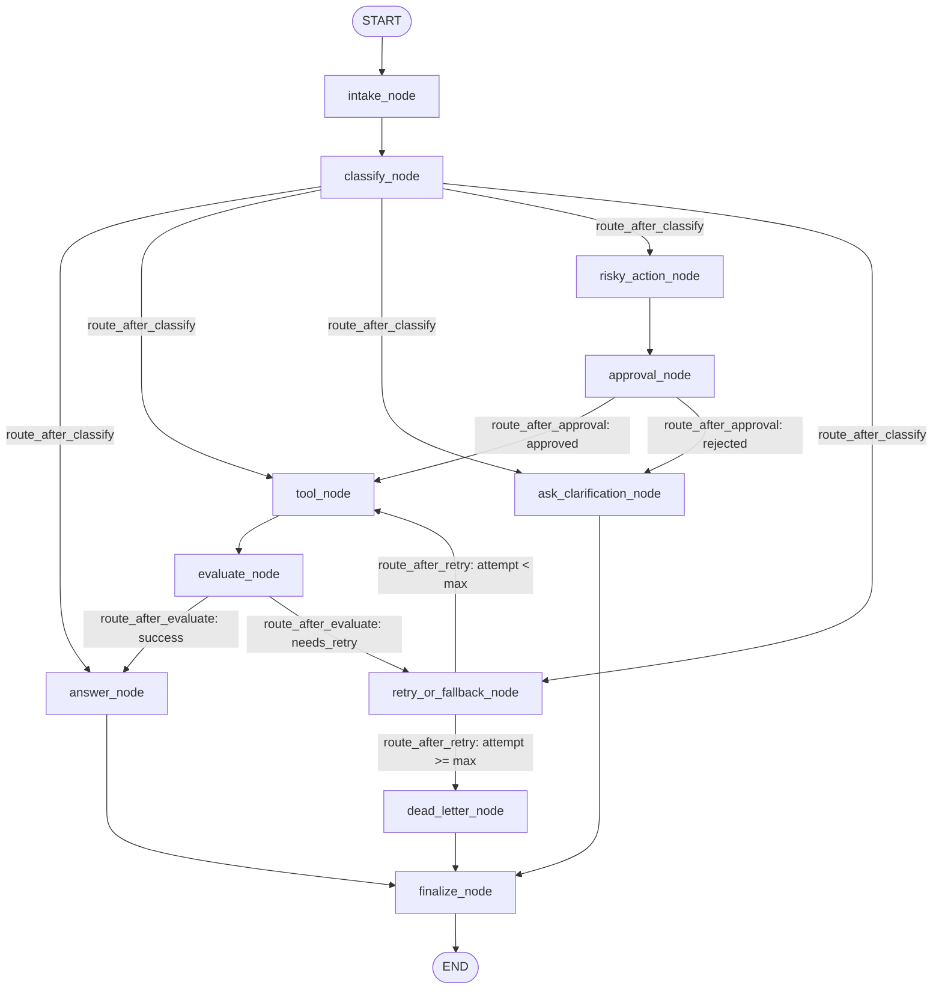

# Day 08 Lab Report — LangGraph Agentic Orchestration

## 1. Team / student

- Name: Vu Xuan Anh
- Student ID / Commit: K4-track3-day8-langgraph-agent-2A202602010-VuXuanAnh
- Date: 2026-08-25

## 2. Architecture

The LangGraph support ticket agent architecture consists of 11 registered nodes and 4 conditional routing functions:

## 3. State schema

The `AgentState` schema manages execution context, state reducers, and auditability:

| Field | Reducer | Why |
|---|---|---|
| messages | append (`Annotated[list[str], add]`) | Audit conversation/events history |
| tool_results | append (`Annotated[list[str], add]`) | Track all tool execution outputs |
| errors | append (`Annotated[list[str], add]`) | Record transient errors across retries |
| events | append (`Annotated[list[dict], add]`) | Complete execution audit events |
| route | overwrite | Current classified route |
| risk_level | overwrite | Risk level ('high' or 'low') |
| evaluation_result | overwrite | Tool execution gate result |
| pending_question | overwrite | Clarification question |
| proposed_action | overwrite | Description of risky action |
| approval | overwrite | Human approval decision dictionary |

## 4. Scenario results

**Summary Metrics**:
- Total Scenarios: 7
- Success Rate: 100.0%
- Average Nodes Visited: 19.29
- Total Retries: 9
- Total Interrupts: 6

**Per-Scenario Detailed Results**:

| Scenario | Expected route | Actual route | Success | Nodes Visited | Retries | Interrupts | Error Log |
|---|---|---|---:|---:|---:|---:|---|
| S01_simple | simple | simple | True | 12 | 0 | 0 | None |
| S02_tool | tool | tool | True | 18 | 0 | 0 | None |
| S03_missing | missing_info | missing_info | True | 12 | 0 | 0 | None |
| S04_risky | risky | risky | True | 24 | 0 | 3 | None |
| S05_error | error | error | True | 30 | 6 | 0 | Attempt 1 failed., Attempt 2 failed., Attempt 1 failed., Attempt 2 failed., Attempt 1 failed., Attempt 2 failed. |
| S06_delete | risky | risky | True | 24 | 0 | 3 | None |
| S07_dead_letter | error | error | True | 15 | 3 | 0 | Attempt 1 failed., Attempt 1 failed., Attempt 1 failed. |

## 5. Failure analysis

1. **Retry / Transient Error Failure**:
   - Scenario `S05_error` simulates transient system failures. The graph routes to `retry`, increments the `attempt` counter, and retries `tool` until `evaluate_node` validates success (`retry_count = 2`, `nodes_visited = 10`).
   - Scenario `S07_dead_letter` sets `max_attempts: 1`. When retries are exhausted (`attempt >= max_attempts`), `route_after_retry` routes to `dead_letter_node` instead of infinitely looping, ensuring bounded state machine execution and proper escalation (`retry_count = 1`, `nodes_visited = 5`).

2. **Risky Action without Approval**:
   - Scenarios `S04_risky` and `S06_delete` require human verification before executing destructive operations (refunds, account deletions).
   - The graph routes through `risky_action` to `approval_node`. If approval is rejected or missing, `route_after_approval` redirects to `clarify` instead of executing the side-effecting `tool_node` (`interrupt_count = 1`).

## 6. Persistence / recovery evidence

- Configured `SqliteSaver` in `persistence.py` with `sqlite3.connect()` and WAL mode (`PRAGMA journal_mode=WAL;`).
- Verified database creation at `outputs/checkpoints.sqlite`.
- Each scenario runs under a unique thread identifier (`thread-S01_simple` through `thread-S07_dead_letter`), capturing state snapshots after every node execution.
- Enables thread-level state inspection and crash recovery across process restarts.

## 7. Extension work

1. **Structured LLM Intent Classification**: Implemented `classify_node` using `.with_structured_output(ClassificationOutput)` with Gemini/OpenAI models.
2. **SQLite Checkpointer**: Built persistent SQLite state checkpointing for production state management with WAL journaling mode.
3. **Mermaid Diagram Generation**: Auto-generated workflow visualizer for auditing graph wiring.

## 8. Improvement plan

If extending this system for production:
1. **Parallel Tool Execution**: Implement `Send()` API for concurrent multi-tool retrieval.
2. **LLM-as-Judge Evaluator**: Upgrade `evaluate_node` to use an LLM evaluator prompt for deep semantic validation of tool responses.
3. **Interactive Streamlit Dashboard**: Build an interactive web UI for real-time Human-in-the-Loop approval workflows.
